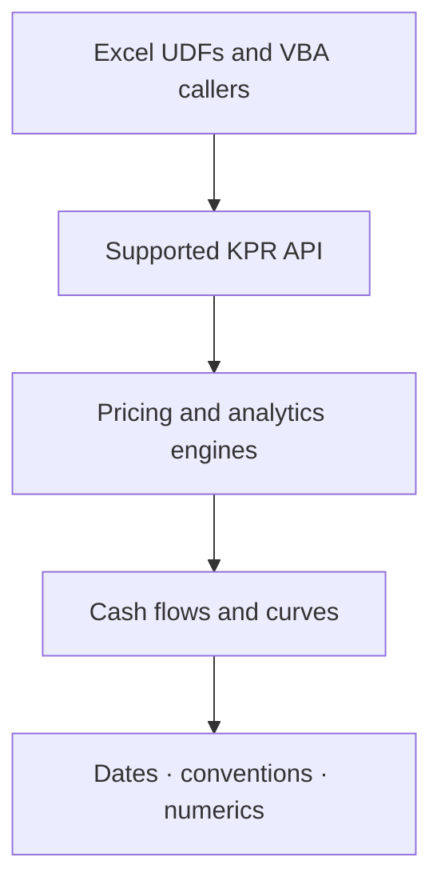

<div align="center">

# 📈 KPR

### Financial analytics and instrument pricing for Excel/VBA

**Explicit conventions · Defensible numerics · Source-first engineering · Excel-native delivery · Reviewable evidence**

<br>

[](#requirements)
[](#requirements)
[](#project-status)
[](#project-status)
[](#target-scope)
[](LICENSE)

<br>

[](https://github.com/danielep71/KPR/releases)
[](https://github.com/danielep71/KPR/issues)
[](https://github.com/danielep71/KPR/stargazers)
[](https://github.com/danielep71/KPR/commits/main)

<br>

[Overview](#overview)
&nbsp;·&nbsp;
[Status](#project-status)
&nbsp;·&nbsp;
[Target scope](#target-scope)
&nbsp;·&nbsp;
[Architecture](#architecture)
&nbsp;·&nbsp;
[Quality model](#quality-model)
&nbsp;·&nbsp;
[Installation](#installation)
&nbsp;·&nbsp;
[Contributing](CONTRIBUTING.md)
&nbsp;·&nbsp;
[Security](SECURITY.md)

</div>

---

<a id="overview"></a>

## ✨ Overview

**KPR** is a new Excel/VBA library for financial analytics and instrument
pricing.

The project is designed for practitioners who need transparent calculations in
Excel without surrendering the model contract to an opaque workbook formula or
an undocumented convention. Its intended foundation is a set of reusable,
source-controlled components that make dates, conventions, cash flows,
numerical methods, prices, and analytical results explicit.

KPR aims to sit between two unsatisfactory extremes:

| Extreme | KPR's intended response |
|---|---|
| A one-off workbook with formulas that are difficult to review and reuse | Exported, modular VBA with documented public contracts |
| A black-box pricing stack that is difficult to inspect from Excel | Transparent algorithms, attributable references, and reproducible tests |

> [!IMPORTANT]
> KPR is currently in repository-initialization and pre-release development. It
> has no stable public API, supported installation package, or production release
> yet. The scope described below is a development direction, not a claim that
> every capability is already implemented.

---

## ⭐ Why KPR

| | Design goal | Practical value |
|---|---|---|
| 📐 | **Convention-explicit** | Day counts, calendars, settlement, compounding, quotation, signs, and curve rules are part of the contract. |
| 🧮 | **Numerically defensible** | Results are compared with independent references, invariants, boundaries, and stated tolerances. |
| 📊 | **Excel-native** | The library is intended for worksheet UDFs and VBA callers without hiding the analytical logic. |
| 🔍 | **Reviewable source** | Exported `.bas`, `.cls`, `.frm`, `.frx`, and RibbonX files provide a diffable engineering record. |
| 🧱 | **API-disciplined** | Supported entry points are separated from callbacks, infrastructure, and internal helpers. |
| 🔒 | **Caller-safe** | Workbook content and global Excel state remain caller-owned unless an API explicitly establishes mutation scope. |
| ⚙️ | **Deployment-conscious** | Design targets managed Windows environments and both 32-bit and 64-bit Office. |
| 🧾 | **Evidence-led** | Validation reports what ran, on which environment, against which reference, and what remains unverified. |

---

<a id="project-status"></a>

## 🚧 Project status

KPR is **pre-release**. Repository governance is being established before the
first supported analytical surface is frozen.

### Status legend

```text
✅ Established     present and usable as repository policy
🚧 In progress     actively being defined or migrated
🧭 Target          planned direction; not yet a supported contract
—  Not published  no supported artifact or public surface exists yet
```

### Current baseline

| Area | Status | Boundary |
|---|---:|---|
| Repository identity and governance | ✅ | KPR-native README, conduct, contribution, security, and changelog baselines |
| Stable public API | — | No API is frozen or supported yet |
| KPR analytical source | 🚧 | Source structure and first foundation modules are not yet release-certified |
| Numerical reference sets | 🧭 | Evidence format and provenance will be defined with each analytical surface |
| Regression harness | 🧭 | No KPR-wide certified regression result is published yet |
| Installable workbook or add-in | — | No official package is available |
| Tagged release | — | No KPR version has been released |

> [!WARNING]
> Files on `main` are development material. Do not describe them as a supported
> KPR release or use them as the sole basis for a material financial decision.

---

<a id="target-scope"></a>

## 🧭 Target scope

KPR is intended to grow in layers, with foundational contracts landing before
instrument pricing that depends on them.

### 1. Dates and conventions

| Capability | Intended coverage |
|---|---|
| 📅 Date handling | Validated Excel/VBA dates, serial boundaries, and deterministic parsing rules |
| 🏦 Business calendars | Reusable holiday calendars, weekends, and calendar composition |
| ↪️ Date rolling | Unadjusted, following, preceding, modified, and nearest-style conventions where specified |
| ⏱️ Day counts | Explicit accrual conventions with documented boundary behavior |
| 🗓️ Schedules | Coupon/payment schedules, stubs, end-of-month behavior, and adjusted/unadjusted dates |

### 2. Rates, discounting, and curves

| Capability | Intended coverage |
|---|---|
| 📈 Rate mathematics | Simple, compounded, continuously compounded, and discount-factor transformations |
| 💰 Time value | Present value, future value, annuity, and cash-flow primitives |
| 📉 Interpolation | Explicit interpolation/extrapolation methods and domains |
| 🧱 Curves | Reviewable curve representations and, later, calibration/bootstrapping components |

### 3. Cash flows and instruments

| Capability | Intended coverage |
|---|---|
| 🧾 Cash flows | Dated, signed, currency-aware cash-flow structures |
| 🏷️ Money-market products | Deposits and related short-rate instruments |
| 📜 Fixed income | Bond cash flows, accrued interest, clean/dirty price, and yield relationships |
| 🔁 Linear derivatives | FRAs, futures-style analytics, and interest-rate swaps as foundations mature |
| 🧩 Extensions | Additional instruments only when conventions, references, and tests are defensible |

### 4. Analytics and risk

| Capability | Intended coverage |
|---|---|
| 🎯 Sensitivities | Transparent finite-difference or analytical measures with bump conventions |
| 🌡️ Scenarios | Deterministic input transformations and reproducible result comparisons |
| 🔎 Diagnostics | Convergence, domain, convention, and missing-input information |
| 📊 Aggregation | Cash-flow and analytical summaries with explicit units and signs |

This is a directional scope, not a release commitment. Exact functions,
signatures, defaults, and sequencing will be documented as they are designed and
validated.

---

## 📐 Financial contracts

Every supported calculation should answer the questions that determine its
meaning:

| Contract dimension | Examples |
|---|---|
| 🧾 Instrument | Cash flows, payoff, rights, obligations, and optionality |
| 📅 Dates | Valuation, trade, settlement, fixing, payment, and maturity |
| 💱 Units | Currency, notional, price scale, rate scale, and output units |
| 🗓️ Conventions | Calendar, roll, day count, frequency, stub, and end-of-month rule |
| 📈 Quotation | Price, yield, rate, spread, volatility, discount factor, or probability |
| 🔁 Compounding | Simple, periodic, continuous, or another stated convention |
| ➕ Signs | Long/short, payer/receiver, asset/liability, and cash-flow direction |
| 📉 Curves | Input type, interpolation, extrapolation, compounding, and missing data |
| 🚧 Domain | Valid, invalid, ambiguous, and unsupported inputs |
| ⚠️ Failure | Error, structured outcome, non-convergence, and unavailable result |
| 🎯 Accuracy | Precision, rounding, absolute/relative tolerance, and reference quality |

> A formula without its financial conventions is not a reusable pricing
> contract.

---

<a id="architecture"></a>

## 🏗️ Architecture

KPR is intended to separate Excel-facing convenience from financial and
numerical logic.



### Layer responsibilities

| Layer | Responsibility | Must not silently decide |
|---|---|---|
| 📊 **Excel surface** | Convert worksheet/VBA inputs and expose supported results | Financial conventions from formatting or locale |
| 🧱 **Public API** | Validate contracts and provide stable caller-facing behavior | Undocumented defaults or compatibility changes |
| 🧮 **Engines** | Apply pricing and analytical algorithms | Data ownership or Excel host state |
| 🧾 **Cash flows and curves** | Represent dated values and market structures | Missing-data or extrapolation policy without a contract |
| 📅 **Foundations** | Dates, calendars, conventions, solvers, and numerical primitives | Instrument-specific assumptions |

### Public versus internal surface

A VBA member being technically `Public` does not automatically make it supported
consumer API. Excel UDF resolution, RibbonX, `Application.Run`, callbacks, tests,
or packaging may require public visibility for infrastructure members.

The eventual supported API will be documented explicitly. Everything else must
be treated as internal and changeable until stated otherwise.

---

## 🛡️ Engineering principles

### Source-first

The authoritative engineering record is exported, reviewable source. Binary
workbooks and add-ins are distribution artifacts, not substitutes for source.

### Caller-owned state

KPR must not infer permission to modify workbook content or global Excel state.
Temporary state changes require explicit ownership, bounded scope, cleanup, and
failure handling.

### Deterministic failures

An invalid domain, ambiguous convention, non-convergence, or missing input must
not produce a plausible-looking result. Failure behavior is part of the public
contract.

### No self-referencing evidence

The implementation under test must not generate its own expected results.
Reference values require independent provenance or independently derived
invariants and limits.

### Environment honesty

Compatibility claims must name the Excel, Windows, Office bitness, locale, and
date system actually tested. Untested configurations remain unverified.

---

<a id="quality-model"></a>

## 🧪 Quality model

KPR's intended validation stack is layered:

| Layer | Question answered |
|---|---|
| 🛠️ **Compile** | Does the complete imported VBA project compile? |
| 🔬 **Unit** | Does each financial/numerical primitive honor its local contract? |
| 🐛 **Regression** | Does every corrected defect remain permanently covered? |
| 📚 **Reference** | Does output match independent values within a justified tolerance? |
| ⚖️ **Invariant** | Do parity, bounds, monotonicity, symmetry, round trips, and limits hold? |
| ↔️ **Boundary** | Are date, domain, discontinuity, and convergence edges explicit? |
| 📊 **Integration** | Do worksheet and VBA entry paths preserve the same financial meaning? |
| 📦 **Artifact** | Does the packaged workbook/add-in correspond to the tested source? |

### Numerical evidence record

A numerical claim should identify:

```text
function and contract
input domain
reference source and precision
absolute / relative tolerance rule
worst observed error and location
Excel / Windows / Office environment
what the evidence does not cover
```

KPR does not currently publish a certified regression count or numerical
accuracy envelope. Those badges and claims will appear only after evidence is
generated and committed or attached to a release.

---

## 📂 Repository structure

```text
KPR/
├─ src/                 exported production VBA and Ribbon source
├─ test/                regression and numerical validation source
├─ demo/                reviewable demonstration source
├─ dist/                distribution guidance and approved artifacts
├─ assets/              documentation assets
├─ images/              repository and social-preview media
├─ README.md             project overview and status
├─ INSTALLATION.md       release installation guidance
├─ CONTRIBUTING.md       engineering and evidence standards
├─ SECURITY.md           security model and disclosure policy
├─ CHANGELOG.md          version history from the first release
└─ LICENSE               MIT License
```

The repository is still being transitioned to its KPR source baseline. Directory
presence alone does not imply that its current contents form a supported KPR
release.

---

<a id="requirements"></a>

## 🖥️ Requirements

These are the intended host requirements, pending certification of the first
release:

| Requirement | Intended baseline |
|---|---|
| Host | Microsoft Excel desktop |
| Operating system | Windows |
| Office architecture | 32-bit and 64-bit |
| VBA | Macros enabled through an organization-approved trust mechanism |
| Host format | Macro-enabled workbook/add-in where deployment requires VBA |
| Runtime dependencies | No mandatory third-party runtime dependency intended |
| Network | No network access intended for core calculations |

Actual supported versions will be stated only after they have been tested.

---

<a id="installation"></a>

## 📦 Installation

No supported KPR installation package exists yet.

> [!WARNING]
> Do not install or redistribute development files from `main` as an official
> KPR workbook or add-in.

The [Installation Guide](INSTALLATION.md) has been reset and will be completed
when the first release candidate defines:

- supported Excel and Windows versions;
- source-import and/or add-in deployment;
- references and macro-trust requirements;
- compilation and post-install validation;
- upgrade and compatibility rules; and
- clean removal.

Future official artifacts will be published only through
[GitHub Releases](https://github.com/danielep71/KPR/releases).

---

## 🔐 Security

KPR runs inside Excel with the permissions of the current user. It is not a
sandbox or authorization layer.

Read [SECURITY.md](SECURITY.md) before deploying macro-enabled code or reporting
a vulnerability. Use synthetic examples and disclose suspected vulnerabilities
privately.

---

## 🤝 Contributing

Contributions are welcome once their financial contract and validation boundary
are explicit.

Before contributing, read:

- [CONTRIBUTING.md](CONTRIBUTING.md) — source, numerical, API, and evidence rules;
- [CODE_OF_CONDUCT.md](CODE_OF_CONDUCT.md) — respectful, evidence-led collaboration;
- [SECURITY.md](SECURITY.md) — private disclosure and data-protection boundaries; and
- [CHANGELOG.md](CHANGELOG.md) — the clean pre-release history baseline.

For material features, pricing models, API changes, dependencies, or
architectural work, open an issue before implementation.

---

## 🗺️ Development sequence

The intended sequence is dependency-led:

1. complete repository transition and define the KPR source baseline;
2. establish dates, calendars, conventions, and schedule contracts;
3. establish rate mathematics and numerical primitives;
4. add cash-flow and curve representations;
5. add instruments only with independent references and contract tests;
6. build a reproducible demo and distribution artifact; and
7. publish the first tagged release with installation and validation evidence.

This sequence may change as design work and evidence reveal better boundaries.

---

## 📜 Versioning and changelog

KPR intends to follow [Semantic Versioning](https://semver.org/) from its first
published release and to maintain release notes in
[Keep a Changelog](https://keepachangelog.com/en/1.1.0/) format.

No version is currently published. See [CHANGELOG.md](CHANGELOG.md).

---

## ⚖️ Financial-model disclaimer

KPR is analytical software, not financial, investment, legal, accounting, or
regulatory advice. Users remain responsible for independent model validation,
market-convention verification, governance, suitability, controls, and review of
all outputs used in a material decision or production process.

---

## 📄 License

KPR is licensed under the [MIT License](LICENSE).

---

<div align="center">

### KPR engineering principle

**Define the convention · Expose the assumption · Prove the number · Preserve the caller · State the boundary**

<br>

Maintained by **Daniele Penza**

</div>
