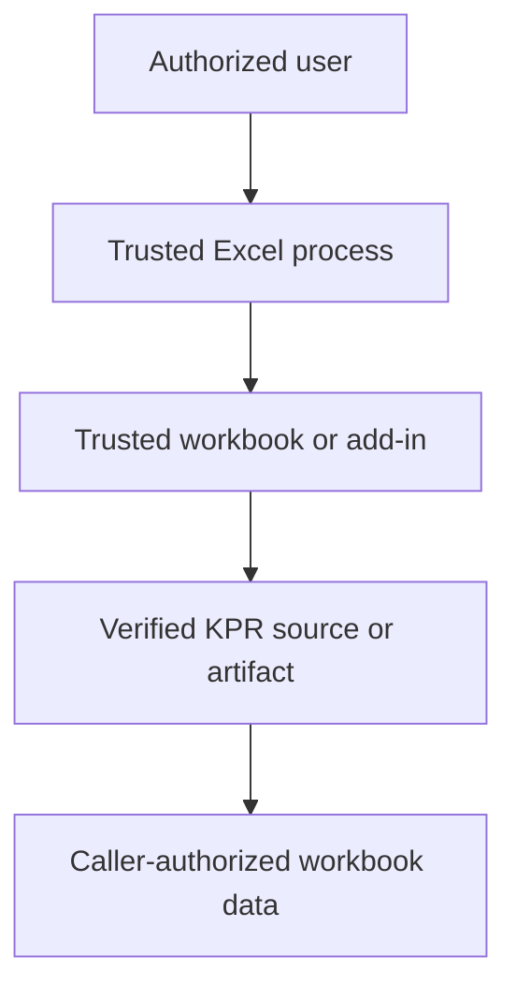

<div align="center">

# 🔒 KPR Security Policy

### Trust boundaries, responsible disclosure, data protection, and release integrity

[](#reporting-a-vulnerability)
[](#supported-versions)
[](#security-model)
[](#security-scope)
[](#financial-data-and-confidentiality)

<br>

**Source-first trust · Least privilege · Private disclosure · Synthetic evidence · Verifiable releases**

<br>

[Supported versions](#supported-versions)
&nbsp;·&nbsp;
[Report privately](#reporting-a-vulnerability)
&nbsp;·&nbsp;
[Security model](#security-model)
&nbsp;·&nbsp;
[Scope](#security-scope)
&nbsp;·&nbsp;
[Data protection](#financial-data-and-confidentiality)
&nbsp;·&nbsp;
[Release integrity](#supply-chain-and-release-integrity)

</div>

---

**KPR** is an Excel/VBA library under development for financial analytics and
instrument pricing.

VBA code executes with the permissions already granted to Microsoft Excel and
the current operating-system user. A defect in an apparently narrow calculation
or workbook integration can therefore affect workbook data, formulas,
application state, linked content, or distributed macro-enabled artifacts.

> [!IMPORTANT]
> KPR is **not a security boundary**. It does not sandbox untrusted workbooks,
> authorize users, enforce workbook permissions, protect secrets, or make
> malicious VBA safe. Only run KPR source or artifacts that you trust and have
> obtained through a verified channel.

---

<a id="supported-versions"></a>

## 🧭 Supported versions

KPR has not yet published its first supported release.

| Version | Security status |
|---|---|
| `main` | Pre-release development; reports reviewed on a best-effort basis |
| `v0.0.1` | Repository-setup pre-release only; reports reviewed on a best-effort basis, with no supported functional API or binary |
| Supported functional releases | None published yet |
| Unofficial forks or repackaged binaries | Not supported by this project |

Once supported functional releases begin, security support will normally apply
to the latest such tagged release. Older-release support, if any, will be stated
explicitly here rather than inferred from the existence of a repository tag.

> [!WARNING]
> Code on `main` may be incomplete, unvalidated, or incompatible without notice.
> It must not be represented as a security-supported production release.

---

<a id="reporting-a-vulnerability"></a>

## 📮 Reporting a vulnerability

Please do **not** disclose a suspected vulnerability in a public issue,
discussion, pull request, commit message, sample workbook, or screenshot.

Preferred reporting path:

1. use GitHub's private vulnerability-reporting option if it is available on the
   repository's **Security** page;
2. otherwise contact the maintainer through an established private channel; and
3. if neither route is available, use GitHub's reporting facilities without
   publishing exploit details.

### Include where possible

| Evidence | Requested detail |
|---|---|
| 🧾 **Identity** | Repository, commit or release, file, module, and procedure |
| 🖥️ **Environment** | Excel, Office bitness, Windows, locale, and deployment model |
| 🎯 **Impact** | Confidentiality, integrity, availability, or supply-chain consequence |
| 🔬 **Reproduction** | Minimal steps using synthetic data |
| 🧨 **Exploitability** | Preconditions, trust level, user interaction, and affected scope |
| 🛡️ **Mitigation** | Workaround or containment already tested, if any |
| 📎 **Evidence** | Sanitized logs, screenshots, stack information, or proof of concept |

Use the smallest proof necessary to establish the issue. Do not attach a real
client, employer, counterparty, student, or personal workbook.

### What to expect

The maintainer will aim to:

1. acknowledge receipt;
2. determine whether the report is within scope;
3. reproduce and assess severity where possible;
4. coordinate a correction and disclosure plan; and
5. credit the reporter if requested and appropriate.

Response and remediation times are best effort, especially before the first
release. Complex Excel/VBA issues may require a particular Office version,
bitness, locale, workbook state, or clean Excel process to reproduce.

> [!NOTE]
> Please allow reasonable time for investigation before public disclosure. If
> active exploitation or an immediate data risk exists, state that clearly in
> the first report.

---

<a id="security-model"></a>

## 🛡️ Security model

KPR assumes that:

```text
Microsoft Excel and the operating system are trusted
the user is authorized to open the workbook or add-in
macros are enabled through an approved trust mechanism
the KPR source or release artifact was obtained from a trusted channel
the host workbook and other loaded VBA projects are not malicious
```

These assumptions are boundaries, not guarantees.

### Trust flow



If any upstream element is untrusted, KPR cannot make the resulting Excel
session safe.

### Intended runtime profile

KPR is intended to remain a local Excel/VBA library with a narrow operational
surface:

- no privileged installer;
- no background service;
- no automatic update mechanism;
- no credential store in the calculation runtime;
- no implicit transmission of workbook or financial data; and
- no mandatory third-party runtime dependency.

These are design intentions for the pre-release project. Any future capability
that changes them must be documented, reviewed, and security-assessed explicitly.

---

<a id="security-scope"></a>

## 🎯 Security scope

### In scope

Security reports are appropriate for vulnerabilities involving:

- unauthorized reading, modification, deletion, or disclosure of workbook data;
- formula, name, link, connection, or worksheet manipulation outside documented
  caller-authorized scope;
- command, macro, formula, or path injection;
- unsafe handling of untrusted strings, file paths, workbook names, or external
  content;
- persistence or execution that occurs without documented user intent;
- corruption of caller-owned Excel application state with security or integrity
  consequences;
- credential, secret, token, or sensitive-data exposure;
- unsafe WinAPI declarations or memory handling;
- malicious or substituted release artifacts;
- dependency, GitHub Actions, or repository-automation compromise; and
- a validation bypass that allows an unsafe artifact to be represented as a
  trusted KPR release.

### Usually handled as ordinary defects

The following normally belong in a public issue using synthetic inputs, unless
they also create a concrete security impact:

- an inaccurate price, yield, cash flow, sensitivity, or date result;
- an unsupported market convention;
- a convergence or precision defect;
- a documentation error;
- a performance regression; or
- an Excel-version compatibility problem.

Financial correctness matters deeply, but a numerical defect is not
automatically a security vulnerability. Treat it as security-sensitive when it
can be deliberately exploited to cross a trust boundary, corrupt protected
data, bypass validation, or compromise a distributed artifact.

### Out of scope

This project cannot remediate:

- vulnerabilities in Microsoft Excel, Office, Windows, or GitHub themselves;
- malicious VBA already trusted and running in the same Excel process;
- organization-specific macro policies, endpoint controls, or access rights;
- social engineering unrelated to KPR source or release channels;
- unofficial forks, modified copies, or binaries not published by this project;
- lost or stolen user credentials; or
- financial losses arising solely from using an unsupported pre-release build.

Relevant upstream vulnerabilities should be reported to the responsible vendor.

---

## 🧱 Runtime security boundaries

### Caller-owned workbook state

KPR code must not assume ownership of a workbook, worksheet, range, formula,
name, link, connection, table, or Excel application setting merely because it is
accessible through the object model.

Security-sensitive or integrity-sensitive state includes:

```text
workbook and worksheet contents
formulas, names, links, and connections
VBA project and macro entry points
Application.Calculation
Application.EnableEvents
Application.DisplayAlerts
Application.ScreenUpdating
Application.StatusBar
active workbook, sheet, range, and selection
file paths and external data locations
```

Mutations must be bounded by the documented API contract. Any temporary state
change must have explicit ownership, cleanup, and failure behavior.

### Errors and diagnostics

Error messages, logs, test reports, and debug output must not expose:

- full confidential file paths unnecessarily;
- workbook content or market data beyond the minimal diagnostic need;
- credentials, tokens, connection strings, or environment secrets; or
- data from a workbook other than the caller-authorized target.

Failing safely is preferable to returning a plausible but unverified result or
continuing after the integrity boundary is uncertain.

### Formula and string injection

Any feature that writes caller-controlled text to a worksheet, name, formula,
path, shell, command, query, or external connection must treat the destination as
an injection boundary. Values beginning with formula-control characters and
strings used to construct formulas or paths require explicit handling and tests.

---

<a id="financial-data-and-confidentiality"></a>

## 🔐 Financial data and confidentiality

Do not submit real:

- trades, positions, portfolios, counterparties, or valuations;
- curves, market data, vendor extracts, or proprietary model outputs;
- client, employer, student, or personal workbooks;
- credentials, internal hostnames, network paths, or connection strings; or
- screenshots containing hidden or incidental sensitive information.

Use synthetic data that preserves only the behavior required to reproduce the
issue.

> [!CAUTION]
> Macro-enabled workbooks can retain hidden names, VBA, metadata, cached values,
> external links, connections, custom XML, and document properties. Deleting
> visible worksheet values is not sufficient sanitization.

### Third-party data and licenses

Market data and vendor outputs may be contractually restricted even when they do
not contain personal data. A numerical reference must be legally redistributable
or described without publishing the restricted source content.

---

<a id="supply-chain-and-release-integrity"></a>

## 📦 Supply chain and release integrity

KPR is source-first: exported VBA and configuration files in Git are the primary
review surface. Macro-enabled binaries introduce a separate trust boundary.

### Source controls

Contributions should preserve:

- reviewable `.bas`, `.cls`, `.frm`, `.frx`, and RibbonX sources;
- explicit provenance for adapted algorithms and reference datasets;
- pinned or otherwise controlled automation dependencies;
- least-privilege workflow permissions;
- separation between production logic, tests, demos, and release artifacts; and
- no secrets or signing material committed to the repository.

### Release controls

Before a future KPR binary is described as a supported release, the project
should establish and record:

```text
source commit and tag identity
successful compilation
relevant regression and numerical-reference results
artifact build procedure
artifact version and filename
SHA-256 digest after final build and validation
known environment and coverage boundaries
release notes and installation guidance
```

KPR currently publishes no supported binary. Until the first release process is
defined, no workbook or add-in should be presented as an official KPR package.

### Verifying future artifacts

When releases exist, obtain them only from:

```text
https://github.com/danielep71/KPR/releases
```

Compare any published digest after download and before enabling macros. A digest
proves file identity relative to the published value; it does not by itself prove
that the artifact was built from the tagged source or that the source is safe.

---

## 🤖 Repository automation and credentials

GitHub Actions and other repository automation must:

- request only the permissions required for the job;
- use repository secrets rather than committed credentials;
- avoid printing secrets or sensitive API responses;
- pin third-party actions to reviewed revisions where practical;
- keep analytics, release, validation, and deployment credentials separate; and
- treat fork-originated or untrusted pull-request code as untrusted input.

A passing operational workflow is not proof of source correctness, numerical
accuracy, release provenance, or artifact safety.

---

## ✅ Safe-use checklist

```text
[ ] Obtain KPR only from the official repository or Releases page
[ ] Review the source or use a release approved by your organization
[ ] Verify any published artifact digest before enabling macros
[ ] Use organizational macro-signing and trusted-location policies where required
[ ] Test in a non-production workbook with synthetic data first
[ ] Back up important workbooks before integrating pre-release code
[ ] Confirm the intended workbook, worksheet, range, and financial conventions
[ ] Do not store secrets or restricted market data in examples or configuration
[ ] Revalidate outputs independently for material financial use
[ ] Report suspected vulnerabilities privately
```

---

## ⚖️ Security and financial-model disclaimer

Security review does not certify financial correctness, and numerical validation
does not certify security. Users remain responsible for independent model
validation, governance, access control, change management, macro policy, and
suitability for their use case.

---

<div align="center">

### Security principle

**Trust the source deliberately · Minimize privilege · Protect the data · Verify the artifact · Report privately**

<br>

Maintained by **Daniele Penza**

</div>
